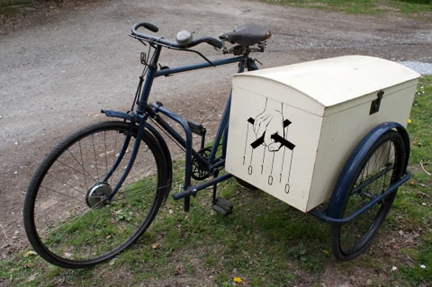

# Sidecar [](https://github.com/huan/sidecar/actions/workflows/npm.yml)

Sidecar is a runtime hooking tool for intercepting function calls by TypeScript annotation with ease, powered by Frida.RE.



> Image source: [1920s Raleigh Box Sidecar Outfit](https://oldbike.wordpress.com/1920s-raleigh-box-sidecar-outfit/) & [ShellterProject](https://www.shellterproject.com/)

## What is a "Sidecar" Pattern?

> Segregating the functionalities of an application into a separate process can be viewed as a Sidecar pattern. The Sidecar design pattern allows you to add a number of capabilities to your application without the need of additional configuration code for 3rd party components.
>  
> As a sidecar is attached to a motorcycle, similarly in software architecture a sidecar is attached to a parent application and extends/enhances its functionalities. A Sidecar is loosely coupled with the main application.  
>  
> &mdash; SOURCE: [Sidecar Design Pattern in your Microservices Ecosystem, Samir Behara, July 23, 2018](https://samirbehara.com/2018/07/23/sidecar-design-pattern-in-your-microservices-ecosystem/)

## What is a "Hooking" Patern?

> Hook: by intercepting function calls or messages or events passed between software components.  
> &mdash; SOURCE: [Hooking, Wikipedia](https://en.wikipedia.org/wiki/Hooking)

## Requirements

### Mac

1. Disable [System Integrity Protection](https://support.apple.com/en-us/HT204899)

## Install

```sh
npm install sidecar
```

## Usage

```ts
import {
  Sidecar,
  HookCall,
  Hook,
  OnEnter,
  OnLeave,
  Replace
}                       from 'sidecar'

@Sidecar('factorial-daemon')
class ProcessSideCar {
  @Func(0x33444) reset (): void
  @Hook 
}

```

## Example

```ts
// tbw
```

## Related project: FFI Adapter

I have another NPM module named [ffi-adapter](https://github.com/huan/ffi-adapter), which is a Foreign Function Interface Adapter Powered by Decorator & TypeScript.

```ts
import {
  LIBRARY,
  API,
  RETURN,
}             from 'ffi-adapter'

@LIBRARY('./libfactorial')
export class LibFactorial {
  @API() factorial (n: number): number { return RETURN(n) }
}

const lib = new LibFactorial()
console.log('factorial(5) =', lib.factorial(5))
// Output: factorial(5) = 120
```

See examples at <https://github.com/huan/ffi-adapter/tree/master/tests/fixtures/library>

## Resources

### Papers

1. [Assembly to Open Source Code Matching for Reverse Engineering and Malware Analysis](https://pdfs.semanticscholar.org/00d8/9af14d1632499636917613a27edac5cf5005.pdf)

### Dll

1. [Wikipedia: DLL injection](https://en.wikipedia.org/wiki/DLL_injection)
1. [Code Tutorial: InjectDLL](http://www.quantumg.net/injectdll.php)

### Frida

1. TypeScript - [Frida环境搭建 - windows (给IDE提供智能感知/提示)](https://bbs.pediy.com/thread-254086.htm)
1. TypeScript - [Example - Frida agent written in TypeScript](https://github.com/oleavr/frida-agent-example)
1. Talk Video - [Prototyping And Reverse Engineering With Frida by Jay Harris](https://www.youtube.com/watch?v=cLUl_jK59EM)
1. Talk Video - [r2con 2017 - Intro to Frida and Dynamic Machine Code Transformations by Ole Andre](https://www.youtube.com/watch?v=sBcLPLtqGYU)
1. [Hand-crafted Frida examples](https://github.com/iddoeldor/frida-snippets)
1. Slide - [基于 FRIDA 的全平台逆向分析 - caisi.zz@alipay.com](https://www.slideshare.net/ssusercf6665/frida-107244825) ([GitHub repo](https://github.com/ChiChou/gossip-summer-school-2018/blob/master/ios-macOS-fake-location/fake.js))
1. [Awesome Frida](https://github.com/dweinstein/awesome-frida)
1. [How to call methods in Frida Gadget (JavaScript API iOS)](https://github.com/frida/frida/issues/567)
1. [Frida调用栈符号恢复](http://4ch12dy.site/2019/07/02/xia0CallStackSymbols/xia0CallStackSymbols/)
1. [Cross-platform reversing with Frida, Oleavr, NoConName December 2015](https://frida.re/slides/ncn-2015-cross-platform-reversing-with-frida.pdf)
1. [Frida: JavaScript API](https://frida.re/docs/javascript-api/)
1. [Calling native functions with Frida, @poxyran](https://poxyran.github.io/poxyblog/src/pages/02-11-2019-calling-native-functions-with-frida.html)
1. [Shellcoding an Arm64 In-Memory Reverse TCP Shell with Frida, Versprite](https://versprite.com/blog/application-security/frida-engage-part-two-shellcoding-an-arm64-in-memory-reverse-tcp-shell-with-frida/)
1. [Anatomy of a code tracer, Ole André Vadla Ravnås, Oct 24, 2014](https://medium.com/@oleavr/anatomy-of-a-code-tracer-b081aadb0df8)
1. [frida-boot 👢
a binary instrumentation workshop, using Frida, for beginners, @leonjza](http://lib.21h.io/library/5UT97EFH/download/FNGRSN2C/3c5bde85-2f1b-4eee-9a98-c2d959d732ee.pdf)
1. [frida javascript api手册](https://www.cnblogs.com/Eeyhan/p/13414629.html)
1. [Frida 12.7 Released - CModule](https://frida.re/news/2019/09/18/frida-12-7-released/)
1. [Getting Started with Frida: Hooking a Function and Replacing its Arguments](https://blog.fadyothman.com/getting-started-with-frida-hooking-main-and-playing-with-its-arguments/)

### Unicode

1. [字符编码笔记：ASCII，Unicode 和 UTF-8, 阮一峰，2007年10月28日](http://www.ruanyifeng.com/blog/2007/10/ascii_unicode_and_utf-8.html)

### Assembler

- [Online x86 / x64 Assembler and Disassembler](https://defuse.ca/online-x86-assembler.htm) (`0xf` is not valid, use `0x0f` instead)
- [易语言汇编代码转置入代码开源](https://www.eyuyan.la/post/15447.html)
- [The 32 bit x86 C Calling Convention](https://aaronbloomfield.github.io/pdr/book/x86-32bit-ccc-chapter.pdf)

### iOS

- [iOS逆向分析笔记](https://www.jianshu.com/p/157f56d60a59)
- [iOS — To swizzle or not to swizzle?](https://medium.com/rocknnull/ios-to-swizzle-or-not-to-swizzle-f8b0ed4a1ce6)

### Objective C

- [Learn Object-C Cheatsheet](http://cocoadevcentral.com/d/learn_objectivec/)
- [Objective-C // Runtime Method Injection](http://labs.distriqt.com/post/846)

## History

### Master

### 0.0.1 (Jun 13, 2021)

Init version.

## Author

[Huan LI](https://github.com/huan) ([李卓桓](http://linkedin.com/in/zixia)), [Microsoft Regional Director](https://rd.microsoft.com/en-us/huan-li), zixia@zixia.net

[](https://stackexchange.com/users/265499)

## Copyright & License

- Docs released under Creative Commons
- Code released under the Apache-2.0 License
- Code & Docs © 2018 Huan LI \<zixia@zixia.net\>
